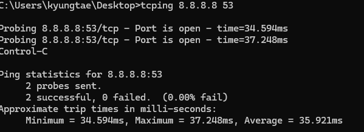
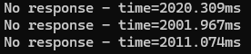

# tcping
ping과 유사하지만 TCP 연결을 기반으로 하는 네트워크 연결 테스트 도구

1. mac
설치
```
brew install tcping
```

```
tcping  [Server IP] [Server Port]
```
포트가 열려있을경우 open 

닫혀있을경우 closed

2. windows
[다운로드] (https://www.elifulkerson.com/projects/tcping.php)

C:\Windows로 옮기거나 exe파일이 존재하는 곳에서 cmd로 사용한다 

```
tcping [Option] [Server IP] [Server Port]
```

| 옵션        | 설명 |
|------------|------------------------------------------------------------------|
| `-t`      | `Control + C`를 통해 중지될 때까지 계속 `ping`을 실행 |
| `-n`      | `n`개의 `ping` 결과를 확인 (기본값: 4) |
| `-i`      | `ping` 사이의 간격을 `n`초로 설정 (기본값: 1) |
| `-w`      | 응답 대기 시간을 `N`초로 지정 |
| `-d`      | 각 행에 날짜와 시간을 표시 |
| `-f`      | 연결에 발생한 트래픽 외 1바이트를 강제로 전송 |
| `-g`      | `n`개의 `ping`이 실패하면 `tcping` 종료 |
| `-b`      | 경고음을 사용 (`1 = 실패 시, 2 = 성공 시, 3 = 변경 시, 4 = 항상`) |
| `-r`      | `n`번 체크 후 DNS 정보를 다시 가져옴 |
| `-s`      | `ping` 결과가 정상일 경우 `tcping` 종료 |
| `-v`      | `tcping` 버전 정보 확인 |
| `-j`      | `jitter` 값 표시 (`jitter`는 마지막 응답 시간과 과거 평균과의 차이) |
| `-4`      | IPv4 통신 사용 |
| `-6`      | IPv6 통신 사용 |
| `-c`      | 처음 상태 체크 후 상태 변경 시 출력 |
| `--tee`   | `tcping` 결과를 파일로 저장 |
| `--file`  | DNS 리스트 및 포트가 저장된 파일을 호출하여 `ping` 체크 수행 (`-j`, `-c` 옵션 사용 불가) |
| `--fqdn`  | 역방향 DNS를 사용할 경우 DNS 이름을 출력 |
| `--color` | 오류 메시지를 유색 출력 (`--ansi` 옵션과 함께 사용 가능) |
| `-h`      | HTTP 모드 (`http://`가 없는 URL 사용) (`-u` 옵션과 함께 사용하면 유용) |
| `-u`      | 각 행에 대상 URL을 표시 |
| `--post`  | 체크 시 `GET` 대신 `POST` 사용 |
| `--head`  | 체크 시 `GET` 대신 `HEAD` 사용 |


성공


실패시 
